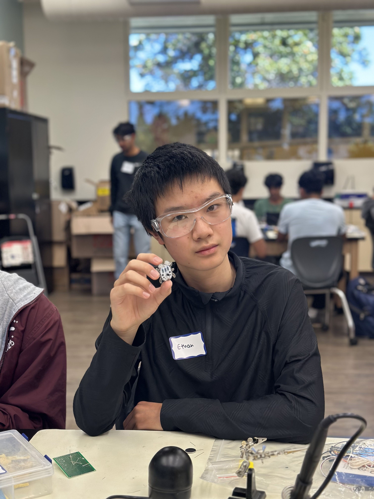

# Shuttle Motion Simulator
The Shuttle Motion Simulator uses a cable controlled model shuttle to simulate landing and docking maneuvers. It is a simple way to model real-world docking events, and uses a simple camera and LCD setup in order to more accurately simulate FPV control over maneuvers. I chose this project and the addition of a camera and display because of my interest in aerospace and my goal to practice better wire management due to the usage of two arduinos and separate systems.


| **Engineer** | **School** | **Area of Interest** | **Grade** |
|:--:|:--:|:--:|:--:|
| Ethan W | Basis Independent Silicon Valley | Mechanical Engineering | Incoming Sophomore


  
# Final Milestone
<iframe width="560" height="315" src="https://youtu.be/3MHO_wMmPMY?si=_NkFVWMP7FfsYIVZ" title="YouTube video player" frameborder="0" allow="accelerometer; autoplay; clipboard-write; encrypted-media; gyroscope; picture-in-picture; web-share" referrerpolicy="strict-origin-when-cross-origin" allowfullscreen></iframe>
Accomplishments: I attached the camera, Arduino Nano, breadboards, and batteries to the camera rig, and tied together the LCD cables. I also mounted the LCD breadboard at an angle so the footage was easier to see, as well as mounting both breadboards and the Arduino Mega onto this folding backer as a laptop-like display/control interface. 

Surprises: The main surprise was the weight of the camera rig components, which made the servos somewhat slower. Additionally, the range of motion wasn't affected much.

Challenges: The main challenge was putting the breadboards, batteries, camera, and Nano onto the rig, which was designed to just fit the camera. This caused the wires to stick out a bit, although this wasn't an issue due to the batteries also making the rig taller. However, the mounting of the battery on the left caused balance issues because the right side wasn't heavy enough to maintain cable tension when banking right. To compensate for this, I mounted a battery on the right wing as a counterweight, which resolved the issue somewhat.

Future Goals: one of the main flaws of the current camera rig is its limited range of motion, caused by the lack of a fourth servo. Adding a fourth servo would allow it to move around more while also making it more stable.


# Second Milestone 
<iframe width="560" height="315" src="https://youtu.be/8HalHi81rF8?si=jJ6Dv1qKAJbSUk7u" title="YouTube video player" frameborder="0" allow="accelerometer; autoplay; clipboard-write; encrypted-media; gyroscope; picture-in-picture; web-share" referrerpolicy="strict-origin-when-cross-origin" allowfullscreen></iframe>
Accomplishments: I added a camera and LCD to display the camera footage, allowing for easier use(the screen lets the user monitor the craft's position while still keeping the buttons in view. The wiring to the LCD is long enough so that the addition of these components does not affect the craft's range of motion except at low altitude, where cable tension is affected by the contact of the cables with the ground. 

Surprises: The main surprise was the quality of the camera footage, which was better than I expected. The small size of the screen somewhat limited visibility, as did the fixed position of the camera, but maneuvering the craft alleviated this issue. Additionally, the use of the Nano helped keep the messier wiring on the craft, allowing the breadboard for the LCD and the control panel to be neat and easier to use.

Challenges: The main challenge was getting the LCD to display good quality footage. I rewired the camera+LCD setup six times in total. The first four attempts were done with the Arduino Uno and failed due to poor messy wiring, which led to the screen flashing white and re-registering the camera(essentially like restarting a computer). I improved my wire management significantly with the fifth wiring attenpt, but due to the distance from the camera to the Arduino Uno(the maneuvering of the craft necessitated long jumper wires), the signals traveled too slowly from the camera to the arduino, leading to jumbled footage. On the sixth attempt, the usage of the Arduino Nano mounted onto the camera rig itself helped significantly, as this enabled short wires from the camera to the arduino and less wiring in general, keeping the wiring for the LCD much cleaner.

Future Goals: I need to finish mounting the camera rig to the cables, which requires the addition of another power source(probably a battery) to power the Arduino Nano, as well as some way to put all the wiring and breadboards onto the camera rig.


For your second milestone, explain what you've worked on since your previous milestone. You can highlight:
- Technical details of what you've accomplished and how they contribute to the final goal
- What has been surprising about the project so far
- Previous challenges you faced that you overcame
- What needs to be completed before your final milestone 

# First Milestone
<iframe width="560" height="315" src="https://www.youtube.com/embed/MAaRaNteI0c?si=KQu6bAZFjkO3p2qe" title="YouTube video player" frameborder="0" allow="accelerometer; autoplay; clipboard-write; encrypted-media; gyroscope; picture-in-picture; web-share" referrerpolicy="strict-origin-when-cross-origin" allowfullscreen></iframe>
Accomplishments: I finished uploading the code, wiring the servos and buttons, and mounting everything within the frame. All servos can operate independently or in unison to execute maneuvers, making the movements more accurate.

Surprises: What has been surprising is the use of buttons to actuate single servos, which makes doing simple maneuvers like moving upward somewhat cumbersome. I'll reprogram the code in order for each button to perform a maneuver with multiple servos actuated(eg moving up, moving down, banking left, banking right). This would make faster changes in direction possible, because with the current button programming, different keybinds are required in order to complete maneuvers, making changes in direction take longer.

Challenges: The main challenge with this milestone was the messy wiring I used for the buttons, which I'll revise once I'm done with the wiring for the camera module. Additionally, learning how to use the different servos was a problem, as I had to use multiple buttons to actuate multiple servos and complete maneuvers. In the future I will be revising this.

Future Goals: I need to complete the shuttle itself, as well as the camera and LCD wiring. Additionally, I need to program the code for the wiring and enable the camera to be mounted within the shuttle, and I need to be able to adjust the camera focus while keeping the camera inside of the shuttle. Finally, as previously stated, I need to reprogram the buttons in order to make maneuvers easier to accomplish.

# Starter Milestone
<iframe width="560" height="315" src="https://www.youtube.com/embed/oA3Xlxy_Wso?si=tPOvhmSEODm8cOr3" title="YouTube video player" frameborder="0" allow="accelerometer; autoplay; clipboard-write; encrypted-media; gyroscope; picture-in-picture; web-share" referrerpolicy="strict-origin-when-cross-origin" allowfullscreen></iframe> 

My starter project, the Weevil Eye, is a simple build which lights up when the environment around it is dark. It uses a photoresistor in order to change light output as light in the environment decreases because its resistance varies with light exposure.
 

Code:

```c++
// control three continuous rotation servos with six buttons
// (two buttons per servo for forward/backward control)

// include servo library
#include <Servo.h>;

// variables for pins
// servos
const int servo1pin = 8;
const int servo2pin = 9;
const int servo3pin = 10;

// control buttons
const int button1 = 2;
const int button2 = 3;
const int button3 = 4;
const int button4 = 5;
const int button5 = 6;
const int button6 = 7;

// corresponding variables for button states

int servo1forward;  // button 1 will make servo 1 go forward
int servo1backward; // button 2 will make servo 1 go backward
int servo2forward;  // button 3 will make servo 2 go forward
int servo2backward; // button 4 will make servo 2 go backward
int servo3forward;  // button 5 will make servo 2 go forward
int servo3backward; // button 6 will make servo 2 go backward

// servo speeds: a continuous rotation servo
// will stop when this variable equals 90,
// spin full speed in one direction when it equals 180,
// and spin full speed the other direction when it equals 0
// so, to slow the servos down, change the speed values to make
// them closer to 90
const int stopspeed = 90;
const int forwardspeed = 180;
const int backwardspeed = 0;

// create servo objects
Servo servo1;
Servo servo2;
Servo servo3;

void setup(){ // setup code that only runs once
  // attach servo objects to pins
  servo1.attach(servo1pin);
  s/Users/ethanwang/Downloads/LiveOV7670-master/src/lib/LiveOV7670Libraryervo2.attach(servo2pin);
  servo3.attach(servo3pin);
  // set button pins as inputs with pullup resistors
  pinMode(button1,INPUT_PULLUP);
  pinMode(button2,INPUT_PULLUP);
  pinMode(button3,INPUT_PULLUP);
  pinMode(button4,INPUT_PULLUP);
  pinMode(button5,INPUT_PULLUP);
  pinMode(button6,INPUT_PULLUP);
  // initialize serial communication
  Serial.begin(9600);
}

void loop(){ // code that loops forever
  // read the states of all 6 buttons. We use the "not" operator
  // (!) to make it so each variable will be HIGH when the corresponding
  // button is pushed and LOW when it is not pushed.
  servo1forward = !digitalRead(button1);
  servo1backward = !digitalRead(button2);
  servo2forward = !digitalRead(button3);
  servo2backward = !digitalRead(button4);
  servo3forward = !digitalRead(button5);
  servo3backward = !digitalRead(button6);
  
  // There are four possibilities for each motor and the
  // corresponding pair of buttons:
  // 1: neither button pushed
  // 2: first button pushed, second button not pushed
  // 3: first button not pushed, second button pushed
  // 4: both buttons pushed
  // we want the motor to spin either forward or backward if one
  // button is pushed, and not spin at all if neither or both
  // buttons are pushed
  
  // motor 1
  if(servo1forward && !servo1backward){ // only forward button is pushed
    servo1.write(forwardspeed);         // set to forward speed
    Serial.print("Motor 1: Forward  | ");
  }
  else if(!servo1forward && servo1backward){ // only backward button pushed
    servo1.write(backwardspeed);             // set to backward speed
    Serial.print("Motor 1: Backward | ");
  }
  else{ // neither or both buttons are pushed
    servo1.write(stopspeed);    // stop motor
    Serial.print("Motor 1: Stopped  | ");
  }
  
  // motor 2
  if(servo2forward && !servo2backward){ // only forward button is pushed
    servo2.write(forwardspeed);         // set to forward speed
    Serial.print("Motor 2: Forward  | ");
  }
  else if(!servo2forward && servo2backward){ // only backward button pushed
    servo2.write(backwardspeed);             // set to backward speed
    Serial.print("Motor 2: Backward | ");
  }
  else{ // neither or both buttons are pushed
    servo2.write(stopspeed);    // stop motor
    Serial.print("Motor 2: Stopped  | ");
  }
  
  // motor 3
  if(servo3forward && !servo3backward){ // only forward button is pushed
    servo3.write(forwardspeed);         // set to forward speed
    Serial.println("Motor 3: Forward  | ");
  }
  else if(!servo3forward && servo3backward){ // only backward button pushed
    servo3.write(backwardspeed);             // set to backward speed
    Serial.println("Motor 3: Backward | ");
  }
  else{ // neither or both buttons are pushed
    servo3.write(stopspeed);    // stop motor
    Serial.println("Motor 3: Stopped  | ");
  }
  

}
```

# Bill of Materials

| Elegoo Uno R3 | processes camera inputs and projects them onto LCD screen | <a href="https://www.amazon.com/Arduino-A000066-ARDUINO-UNO-R3/dp/B008GRTSV6/"> Link </a> |
| Elegoo Uno Mega| processes servo inputs through buttons|<a href="https://us.elegoo.com/collections/arduino-kits/products/elegoo-mega-2560-r3-board"> Link </a>
|:--:|:--:|:--:|:--:|
| PVC pipe|forms frame| $10.20 | <a href="https://www.amazon.com/1-1-Schedule-40-PVC-Pipe/dp/B0C547346F?th=1"> Link </a> |
| 3 continuous servos| control cable lengths through rotation | $9.82 | <a href="https://www.pololu.com/product/2820"> Link </a> |
| breadboard| connects buttons and servos to arduino | $7.99 | <a href="https://www.sciencepurchase.com/products/03mb801?variant=39970685583533&currency=USD&utm_source=google&utm_medium=organic&utm_campaign=SP%20-%20Google%20Shopping&utm_content=Solderless%20Breadboard%2C%20400%20Tie-Points%2C%202%20Distribution%20Strips%2C%203.3%20x%202.1%20x%200.3%20Inches&gad_source=1&gad_campaignid=19633918734&gbraid=0AAAAAohSh8DXgBlEBmZVh0XJjJS3tojJR"> Link </a> |
| jumper wires| connect different components together, either directly or through breadboard|$15.55|<a href="https://www.schoolspecialty.com/elenco-jumper-wire-kit-350-pieces-1400717?utm_source=google&utm_medium=cpc&utm_campaign=%28ROI%29%20Standard%20Shopping%20-%20Catch%20All&utm_id=22287672392&utm_content=176056289016&utm_term=&gad_source=4&gad_campaignid=22287672392&gbraid=0AAAAADzuAIKqBZWO7RtdyMsAnlGckWCom"> Link </a> |
# Other Resources/Examples
One of the best parts about Github is that you can view how other people set up their own work. Here are some past BSE portfolios that are awesome examples. You can view how they set up their portfolio, and you can view their index.md files to understand how they implemented different portfolio components.
- [Example 1](https://trashytuber.github.io/YimingJiaBlueStamp/)
- [Example 2](https://sviatil0.github.io/Sviatoslav_BSE/)
- [Example 3](https://arneshkumar.github.io/arneshbluestamp/)

To watch the BSE tutorial on how to create a portfolio, click here.
